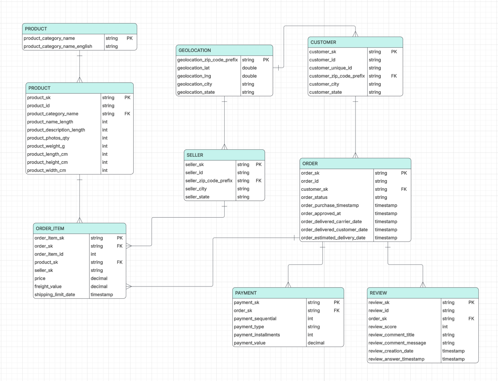

## Data Model - Olist Silver Layer

## Entity-Relationship Diagram (ERD)




## Etites, Attributes, Keys and Relationships

| Entity | Primary Key | Foreign Key | Relationship | 
| :---: | :---: | :---: | :---: |
| CUSTOMERS | customer_sk | customer_zip_code_prefix -> GEOLOCATION | 1 customer to many orders |
| ORDERS | order_sk | customer_sk -> CUSTOMER | 1 order to many order_items, payments, reviews | 
| ORDER_ITEM | order_item_sk | order_sk -> ORDER, product_sk -> PRODUCT, seller_sk -> SELLER | many to many |
| PRODUCT | product_sk | product_category_name -> CATEGORY_TRANSLATION | 1 product to many order_items|
| SELLER | seller_sk | seller_zip_code_prefix -> GEOLOCATION | 1 seller to many payments |
| PAYMENT | payment_sk | order_sk -> ORDER | 1 order to many payments |
| REVIEW | review_sk | order_sk -> ORDER | 1 order to 1 review |
| CATEGORY_TRANSLATION | product_category_name |  | 1 translation to 1 product |
| GEOLOCATION | geolocation_zip_code_prefix |  | 1 geolocation to 1 customer |

## Normal-Form Reasoning

**1NF** - every attribute is atomic where each cell holds a single value. There are no repeating groups or lists in the tables.

**2NF** - there are two entities with a composite key (```ORDER_ITEM: order_id + order_item_id and PAYMENT: order_id + payment_sequential```) and are given their own surrogate key (```order_item_sk and payment_sk```). This avoids partial-key dependecy issues as every other attribute within these tables depends on the whole row identity not just a fragment of the key.

**3NF** - this model satisfies 3NF by separating attributes that describe different entities and removing transitive dependencies. No non-key columns are dependent on other non-key columns
- Product category's English translation lives only in ```CATEGORY_TRANSLATION```, not duplicated onto every ```PRODUCT``` row.
- Zip-code-level latitude/longitude lives only in ```GEOLOCATION```, referenced by zip prefix rather than copied onto ```CUSTOMER/SELLER```.

### Many-to-many
The many-to-many relationship is seen between orders and products (one order can contain many products and one product can appear across many orders). This is resolved by ```ORDER_ITEM``` acting as a bridge entity. It holds foreign keys to both ```ORDER``` and ```PRODUCT``` (plus ```SELLER```, since each line item also has its own seller).

### Deliberate break from strict normalisation
```customer_city``` and ```customer_state``` (and the same for ```seller_city/seller_state```) are kept directly on ```CUSTOMER/SELLER``` rather than being derived solely through the ```GEOLOCATION``` foreign key. Strict 3NF would argue ```city/state``` are dependent on the zip prefix and should live only in ```GEOLOCATION```. This is broken on purpose for two reasons: 

1.  Olist's source data provides ```city/state``` directly on the customer/seller record, and treating it as authoritative avoids depending on ```GEOLOCATION```, which has known data quality issues (multiple latitude/longitude rows per zip prefix and inconsistent city-name) that make it a less reliable source of truth for ```city/state``` than the record's own stated value
2.  it avoids an extra join for a very common analytical need (customer/seller location), at the cost of a small amount of redundancy that in practice won't drift, since these are static reference attributes rather than frequently-updated facts.

